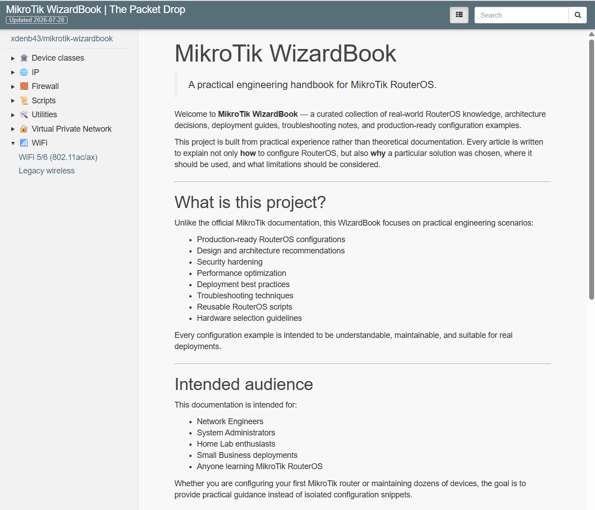

# MikroTik WizardBook

> Practical engineering documentation for MikroTik RouterOS.

## Overview

**MikroTik WizardBook** is a practical engineering knowledge base focused on MikroTik RouterOS.

Unlike traditional documentation, this project emphasizes real-world deployment scenarios, architecture decisions, troubleshooting techniques, and production-ready configuration examples.

The primary goal is to explain not only **how** to configure RouterOS, but also **why** a particular solution should be used.

## Documentation

📖 **Online documentation**

https://xdenb43.github.io/mikrotik-wizardbook/

## Current Topics

- 🏛️ Device Classes
- 🌐 DNS & DNS over HTTPS (DoH)
- 🧱 Firewall
- 🔐 VPN
- 📶 WiFi
- 📜 RouterOS Scripts
- 🛠️ Utilities

## Design Principles

This project follows several simple principles:

- Explain **why**, not only **how**
- Prefer production-ready configurations
- Keep examples reproducible
- Document limitations and trade-offs
- Avoid unnecessary complexity

## Project Status

This documentation is actively maintained and continuously expanded as new RouterOS releases become available.

Current focus:

- RouterOS v7
- Home
- Small Office
- Enterprise deployment practices

## Technology Stack

- MkDocs
- Windmill Theme
- GitHub Pages
- GitHub Actions

## Contributing

Suggestions, corrections and discussions are welcome.

If you find inaccurate information or have a better engineering approach, please open an Issue or submit a Pull Request.

## License

This project is licensed under the MIT License.

> *Knowledge becomes valuable only when it is shared, understood and reproducible.*