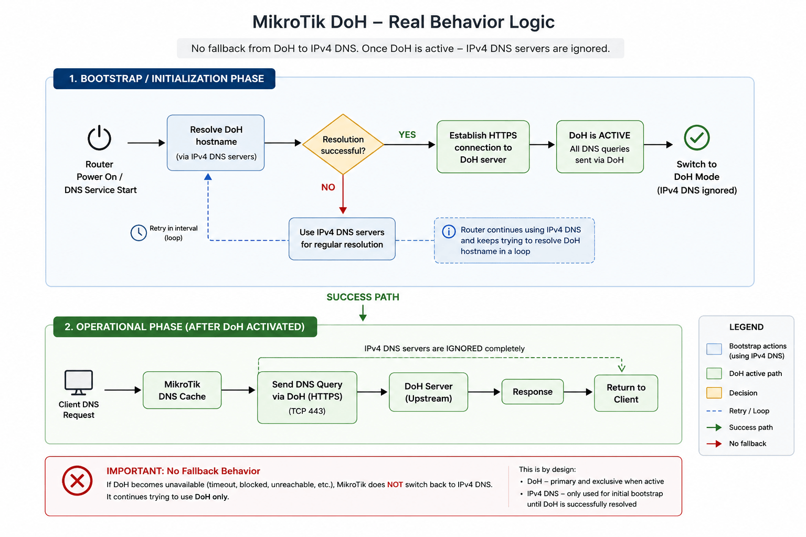

# DNS over HTTPS (DoH)  
Good official doc: <https://manual.mikrotik.com/docs/network-management/dns#dns-over-https-doh>  

---  

  

---  
 
## Fast DoH setup  

!!! caution "Caution"  
    - allow-remote-requests=yes is mandatory to use MikroTik as DNS server  
    - all peer DNS must be disabled  
    - there is no auto-fallback from DoH to IPv4/IPv6 servers!

!!! danger "Danger"  
    Import DoH-required certificates before setting DoH resolver, instruction [here](doh_minimum_certificates.md)  

### Setup commands
```bash
# RoS 7.23
# disable peer dns
/ip dhcp-client 
set use-peer-dns=no numbers=0
/interface lte apn
set [ find default=yes ] use-peer-dns=no    

# enable built-in CAs
/certificate settings set builtin-trust-store=all

/ip dns
set allow-remote-requests=yes \
    cache-max-ttl=1d \
    servers=8.8.8.8,1.1.1.1 \
    use-doh-server=https://dns.google/dns-query \
    verify-doh-cert=yes

# forward all DNS requests to MikroTik itself  
/ip firewall nat
add action=redirect chain=dstnat \
    comment="Incoming DNS redirect" \
    dst-address-type=!local \
    dst-port=53 \
    in-interface-list=LAN \
    protocol=udp
add action=redirect chain=dstnat \
    comment="Incoming DNS redirect" \
    dst-address-type=!local \
    dst-port=53 \
    in-interface-list=LAN \
    protocol=tcp
```  

### How To Check DoH is working
```bash
# RoS 7.23
/tool/sniffer/quick port=443 ip-address=8.8.8.8
Columns: INTERFACE, TIME, NUM, DIR, SRC-MAC, DST-MAC, SRC-ADDRESS, DST-ADDRESS, PROTOCOL, SIZE, CPU
INTERFACE  TIME    NUM  DIR  SRC-MAC            DST-MAC            SRC-ADDRESS          DST-ADDRESS          PROTOCOL  SIZE  CPU
ether1     13.06    37  <-   9C:69:B4:66:DB:BC  F4:1E:57:29:00:BB  8.8.8.8:443 (https)  10.185.95.186:46666  ip:tcp     135    1
ether1     13.06    38  ->   F4:1E:57:29:00:BB  9C:69:B4:66:DB:BC  10.185.95.186:46666  8.8.8.8:443 (https)  ip:tcp      66    1
ether1     13.061   39  ->   F4:1E:57:29:00:BB  9C:69:B4:66:DB:BC  10.185.95.186:46666  8.8.8.8:443 (https)  ip:tcp     119    2
ether1     13.061   40  ->   F4:1E:57:29:00:BB  9C:69:B4:66:DB:BC  10.185.95.186:46666  8.8.8.8:443 (https)  ip:tcp     122    2
ether1     13.061   41  ->   F4:1E:57:29:00:BB  9C:69:B4:66:DB:BC  10.185.95.186:46666  8.8.8.8:443 (https)  ip:tcp     104    2
ether1     13.061   42  ->   F4:1E:57:29:00:BB  9C:69:B4:66:DB:BC  10.185.95.186:46666  8.8.8.8:443 (https)  ip:tcp     177    2
ether1     13.061   43  ->   F4:1E:57:29:00:BB  9C:69:B4:66:DB:BC  10.185.95.186:46666  8.8.8.8:443 (https)  ip:tcp     142    2
ether1     13.087   44  <-   9C:69:B4:66:DB:BC  F4:1E:57:29:00:BB  8.8.8.8:443 (https)  10.185.95.186:46666  ip:tcp      66    1
ether1     13.087   45  <-   9C:69:B4:66:DB:BC  F4:1E:57:29:00:BB  8.8.8.8:443 (https)  10.185.95.186:46666  ip:tcp     104    1
ether1     13.087   46  ->   F4:1E:57:29:00:BB  9C:69:B4:66:DB:BC  10.185.95.186:46666  8.8.8.8:443 (https)  ip:tcp      66    1
ether1     13.087   47  <-   9C:69:B4:66:DB:BC  F4:1E:57:29:00:BB  8.8.8.8:443 (https)  10.185.95.186:46666  ip:tcp      66    1
ether1     13.097   48  <-   9C:69:B4:66:DB:BC  F4:1E:57:29:00:BB  8.8.8.8:443 (https)  10.185.95.186:46666  ip:tcp     356    1
ether1     13.097   49  <-   9C:69:B4:66:DB:BC  F4:1E:57:29:00:BB  8.8.8.8:443 (https)  10.185.95.186:46666  ip:tcp     241    1
ether1     13.097   50  <-   9C:69:B4:66:DB:BC  F4:1E:57:29:00:BB  8.8.8.8:443 (https)  10.185.95.186:46666  ip:tcp     104    1
ether1     13.097   51  ->   F4:1E:57:29:00:BB  9C:69:B4:66:DB:BC  10.185.95.186:46666  8.8.8.8:443 (https)  ip:tcp      66    1
ether1     13.098   52  <-   9C:69:B4:66:DB:BC  F4:1E:57:29:00:BB  8.8.8.8:443 (https)  10.185.95.186:46666  ip:tcp     112    1
ether1     13.098   53  ->   F4:1E:57:29:00:BB  9C:69:B4:66:DB:BC  10.185.95.186:46666  8.8.8.8:443 (https)  ip:tcp      66    2
ether1     13.098   54  ->   F4:1E:57:29:00:BB  9C:69:B4:66:DB:BC  10.185.95.186:46666  8.8.8.8:443 (https)  ip:tcp      66    2
ether1     13.098   55  ->   F4:1E:57:29:00:BB  9C:69:B4:66:DB:BC  10.185.95.186:46666  8.8.8.8:443 (https)  ip:tcp     112    2
ether1     13.128   56  <-   9C:69:B4:66:DB:BC  F4:1E:57:29:00:BB  8.8.8.8:443 (https)  10.185.95.186:46666  ip:tcp      66    1
``` 

---  

## DoH and DNS tuning 

### DNS static entries  
!!! info ""  
    - No static entry for CloudFlare, because it uses agressive anycast and geo-routing
    - Google uses more stable anycast and has `8.8.8.8` as a canonical endpoint
```bash
# RoS 7.23
/ip dns static
add address=8.8.8.8 comment="DNS Google" name=dns.google type=A
add address=8.8.4.4 comment="DNS Google" name=dns.google type=A
```  
---  

### TIMEOUTS tuning 
```text
START
|
|─ [1] Count timeouts
|       |- doh-timeout
|       |- query-server-timeout
|       |- query-total-timeout
|       |- cache-max-ttl
|
|─ [2] Count queries
|       |─ doh-max-server-connections
|       |─ doh-max-concurrent-queries
|       |- max-concurrent-tcp-sessions
|       |- max-concurrent-queries
|
|─ [3] Count cache-size 
|
|─ [4] Balance counted values with recommended ones

END
```  

#### Recomended world-wide values by load  

|        DNS parameter         | Home usage<br>(1-15 devices) | Small Office<br>(15-50 devices) | Large Office<br>(50+ devices) |
| :--------------------------: | :--------------------------: | :-----------------------------: | :---------------------------: |
|        `doh-timeout`         |             3-5s             |              2-3s               |       1-2s (sweet 1,5s)       |
| `doh-max-server-connections` |             5-10             |              10-20              |            50-100+            |
| `doh-max-concurrent-queries` |           100-150            |             200-500             |             1000+             |

#### Hierarchy of stability (for timeouts)
| timout | stability                            |
| :----: | :----------------------------------- |
|   3s   | unstable                             |
|   4s   | borderline (especially Ru and PPPOE) |
|   5s   | stable production                    |
|   6s   | very safe                            |
|  7+s   | used rarely                          |

!!! info "Rules for timeouts"  
    `doh-timeout` >= `query-server-timeout`  
    `query-total-timeout` >= `doh-timeout` × 2 

### DPI/RU tuning public DoH (hAP ax3)

|         DNS parameter         | WAN IPoE | WAN PPPoE |   LTE   | comment                                                         |
| :---------------------------: | :------: | :-------: | :-----: | :-------------------------------------------------------------- |
|         `doh-timeout`         |   4–6s   |   5–7s    |  6–9s   | DPI/LTE: jitters                                                |
|    `query-server-timeout`     |   3–5s   |   4–6s    |  5–7s   | `query-server-timeout` <= `doh-timeout`                         |
|     `query-total-timeout`     |  8–12s   |  10–14s   | 12–18s  | `query-total-timeout` ≥ `doh-timeout` × 2<br>DPI/LTE: jitterы   |

  
#### IPoE
- keep settings closer to the upper limit  
- stable RTT - parallelism is beneficial   
- the goal is **minimal latency**  

#### PPPoE
- PPP encapsulation + MTU 1492  
- more fragmentation sensitivity  
- often TCP retransmit for DPI shaping  
- need less parallelism, higher timeouts, less burst concurrency  

#### LTE
- benefits from less concurrency and a larger timeout window  
- the goal is **not raw speed**, but rather **the absence of failures and retries**

---  
  
### QUERIES tuning by model  

!!! info "Rules for queries"  
    `doh-max-server-connections`: CPU cores × 1.5–2  
    `doh-max-concurrent-queries`: Connections × 4–6  
    `max-concurrent-queries`: DoH Queries × 2    
    `max-concurrent-tcp-sessions`: Queries × 0.5–0.7   

|                 Device class/model                  |          CPU          | DoH Max Server Connections | DoH Max Concurrent Queries | Max Concurrent Queries  | Max Concurrent TCP Cessions |
| :-------------------------------------------------: | :-------------------: | :------------------------: | :------------------------: | :---------------------: | :-------------------------: |
| **Low-End**<br>hAP lite, hAP mini, hAP ac lite, mAP |     1 core MIPSBE     |      2-4<br>sweet: 4       |     8-16<br>sweet: 16      |   16-32<br>sweet: 32    |      6-12<br>sweet: 12      |
|    **Mid-Range**<br>hEX S, hAP ac², hAP ax lite     | 2–4 cores ARM/IPQ40xx |      4-8<br>sweet: 6       |     16-40<br>sweet: 24     |   32-80<br>sweet: 64    |     12-24<br>sweet: 16      |
|   **Edge Mid-Range**<br>hAP ax², hAP ax³, RB4011    |     4 cores ARM64     |      8-12<br>sweet: 8      |     32-64<br>sweet: 48     |   64-128<br>sweet: 96   |     20-40<br>sweet: 24      |
|  **High-End**<br>RB5009, CCR2004, CCR2116, CCR2216  |   4–16+ cores ARM64   |     12-24<br>sweet: 16     |    64-144<br>sweet:  96    | 128 -288<br>sweet:  192 |     32-96<br>sweet: 48      |  

---  

### Cache size by model  
|                 Device class/model                  |   Cache Size    |
| :-------------------------------------------------: | :-------------: |
| **Low-End**<br>hAP lite, hAP mini, hAP ac lite, mAP |  2048–4096 KiB  |
|    **Mid-Range**<br>hEX S, hAP ac², hAP ax lite     | 8192–16384 KiB  |
|   **Edge Mid-Range**<br>hAP ax², hAP ax³, RB4011    | 16384–32768 KiB |
|  **High-End**<br>RB5009, CCR2004, CCR2116, CCR2216  | 32768–65536 KiB |  

---  

### Troubleshooting:   
In case of errors  
- `timeout sending data`  
- `idle timeout`  
- `ssl handshake timeout`  
try to increase timeout firstly  

---   
  
## DoH provider selection considerations for Russia  

#### Key environmental constraints:  
- potential blocking of DoH domains  
- unstable access to public DNS providers (Cloudflare / Google)  
- DPI inspection of HTTPS traffic  
- increased latency when using foreign resolvers   

| DoH role  | DoH provider | Why?                                                                                                                                     | link                                          |
| :-------: | :----------: | :-------------------------------------------------------------------------------------------------------------------------------------- | :--------------------------------------------- |
|  primary  |    Google    | the most stable: <br>- best peering<br>- best routing<br>- more anycast presence<br>- less DPI troubles                                  | `https://dns.google/dns-query`                |
| secondary |  CloudFlare  | fastest but problematic:<br> - unexpected timeouts<br>- packet loss<br>- routing issues ISP side <br>- unexpected periodical high jitter | `https://cloudflare-dns.com/dns-query`        |
| fallback  |    Yandex    | stores everything                                                                                                                        | `https://common.dot.dns.yandex.net/dns-query` |
|  ignore   |    Quad9     | - slow<br>- timeout heavy<br>- problematic routing                                                                                       | `https://dns.quad9.net/dns-query`             |
| specific  |    Comss     | - unstable latency and routing<br>- blocked periodically by UFO<br>- mostly used for DNS FWD                                                                               | `https://dns.google/dns-query`                |

Cloudflare could look faster, but it's due to agressiveness with:  
- edge caching  
- anycast routing  
- TLS optimization  

MikroTik native DoH client is not so stable for such aggressiveness as Chrome DoH or AdGuard or dnsproxy, so even minor network problems will give:  
- `DoH timeout`  
- `SSL handshake failed`  
- `idle timeout`  
- `connection reset`  

#### The best DoH choice depending on the environment  
| Cloudflare DoH               | Google DoH           |
| :---------------------------- | :-------------------- |
| large/federal ISP            | regional ISP         |
| Moscow/Spb                   | unstable WAN or LTE  |
| stable international channel | PPPoE                |
| ARM-based router             | low/mid range router |

---  

## Setup example by model and ISP

#### hAP ax³  

##### > stable WAN connection (balanced values)  
```bash
# RoS 7.23
# model = hAP ax³ | C53UiG+5HPaxD2HPaxD
# WAN IPoE 200Mbps, ISP MTS, Google DoH

/ip dhcp-client 
set use-peer-dns=no numbers=0 
/interface lte apn
set [ find default=yes ] use-peer-dns=no

/ip dns static
add address=8.8.8.8 comment="Google DNS" name=dns.google type=A
add address=8.8.4.4 comment="Google DNS" name=dns.google type=A

# enable built-in CAs
/certificate settings set builtin-trust-store=all
   
/ip dns
set allow-remote-requests=yes cache-max-ttl=12h cache-size=32768KiB \
    doh-max-concurrent-queries=48 doh-max-server-connections=8 \
    max-concurrent-queries=96 max-concurrent-tcp-sessions=24 \
    max-udp-packet-size=1232 \
    query-server-timeout=4s query-total-timeout=10s \
    servers=8.8.8.8,1.1.1.1,77.88.8.8 \
    use-doh-server=https://dns.google/dns-query verify-doh-cert=yes
    
/ip firewall nat
add action=redirect chain=dstnat comment="Incoming DNS redirect" \
    dst-address-type=!local dst-port=53 in-interface-list=LAN protocol=udp
add action=redirect chain=dstnat comment="Incoming DNS redirect" \
    dst-address-type=!local dst-port=53 in-interface-list=LAN protocol=tcp
```  

##### > LTE/non-stable WAN connection  
```bash
not tested
```  
---  

#### hAP ac²  

##### > stable WAN connection  
```bash 
not tested
```   

##### > LTE/non-stable WAN connection  
```bash
not tested
```  

---  

#### hAP ac lite TC  

##### > stable WAN connection  
```bash
# RoS 7.23
# model = hAP ac lite TC | RB952Ui-5ac2nD-TC
# WAN IPoE 200Mbps, ISP MTS, Google DoH

/ip dhcp-client 
set use-peer-dns=no numbers=0 
/interface lte apn
set [ find default=yes ] use-peer-dns=no

/ip dns static
add address=8.8.8.8 comment="Google DNS" name=dns.google type=A
add address=8.8.4.4 comment="Google DNS" name=dns.google type=A

/certificate settings set builtin-trust-store=all
   
/ip dns
set allow-remote-requests=yes cache-max-ttl=12h cache-size=2048KiB \
    doh-max-concurrent-queries=16 doh-max-server-connections=4 doh-timeout=5s \
    max-concurrent-queries=32 max-concurrent-tcp-sessions=12 \
    max-udp-packet-size=1232 \
    query-server-timeout=4s query-total-timeout=10s \
    servers=8.8.8.8,1.1.1.1,77.88.8.8 \
    use-doh-server=https://dns.google/dns-query verify-doh-cert=yes
    
/ip firewall nat
add action=redirect chain=dstnat comment="Incoming DNS redirect" \
    dst-address-type=!local dst-port=53 in-interface-list=LAN protocol=udp
add action=redirect chain=dstnat comment="Incoming DNS redirect" \
    dst-address-type=!local dst-port=53 in-interface-list=LAN protocol=tcp
```  

##### > LTE/non-stable connection
```bash
# RoS 7.23
# model = hAP ac lite TC | RB952Ui-5ac2nD-TC
# LTE 30 Mbps, ISP Yota, Google DoH
/ip dhcp-client 
set use-peer-dns=no numbers=0 
/interface lte apn
set [ find default=yes ] use-peer-dns=no

/ip dns static
add address=8.8.8.8 comment="Google DNS" name=dns.google type=A
add address=8.8.4.4 comment="Google DNS" name=dns.google type=A

/certificate settings set builtin-trust-store=all
   
/ip dns
set allow-remote-requests=yes cache-max-ttl=1d cache-size=2048KiB \
    doh-max-concurrent-queries=16 doh-max-server-connections=4 doh-timeout=7s \
    max-concurrent-queries=32 max-concurrent-tcp-sessions=12 \
    max-udp-packet-size=1232 \
    query-server-timeout=6s query-total-timeout=15s \
    servers=8.8.8.8,1.1.1.1,77.88.8.8 \
    use-doh-server=https://dns.google/dns-query verify-doh-cert=yes
    
/ip firewall nat
add action=redirect chain=dstnat comment="Incoming DNS redirect" \
    dst-address-type=!local dst-port=53 in-interface-list=LAN protocol=udp
add action=redirect chain=dstnat comment="Incoming DNS redirect" \
    dst-address-type=!local dst-port=53 in-interface-list=LAN protocol=tcp
```  
