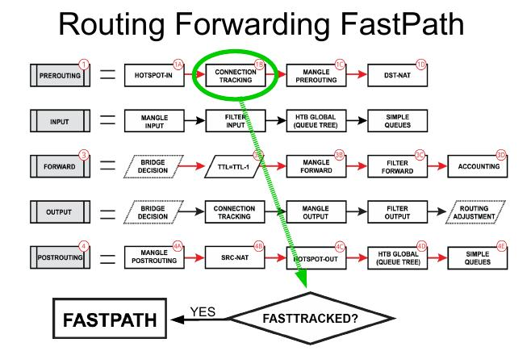

# FastTrack in RouterOS
Official documentation: <https://manual.mikrotik.com/docs/firewall-and-quality-of-service/connection-tracking#fasttrack>

---  

## How it works  

  
```text
NEW connection
    ↓
conntrack
    ↓
firewall/mangle/NAT
    ↓
connection becomes established
    ↓
FastTrack rule match
    ↓
subsequent packets bypass slow path
```  

!!! attention "Improtant"    
    FastTrack works reliably only with the **main** routing table  
    traffic using policy routing, VRF, or routing marks should usually be excluded  
---  

## defconf:  
```bash
/ip firewall filter

add action=fasttrack-connection chain=forward \
    comment="defconf: fasttrack" \
    connection-state=established,related
    
add action=accept chain=forward \
    comment="defconf: accept established,related, untracked" \
    connection-state=established,related,untracked

add action=drop chain=forward \
    comment="defconf: drop invalid" \
    connection-state=invalid
```   
The `accept` rule after FastTrack is mandatory because some packets still use the normal processing path.  
If you use any connection marking - just add `connection-mark=no-mark` condition to `fasttrack-connection` action

```bash
/ip firewall filter
add action=fasttrack-connection chain=forward \
    comment="defconf: fasttrack" \
    connection-mark=no-mark \
    connection-state=established,related
```  
---  

## NOT use FastTrack  

#### Usually exclude:  
- WireGuard with policy routing  
- IPsec  
- VRF  
- QoS / CAKE / FQ-Codel  
- queue tree  
- advanced mangle rules  
- traffic accounting  
- containers with custom routing  
- multi-WAN policy routing  

#### Recommended approach:  
1. exclude specific traffic first  
2. fasttrack only regular LAN↔WAN traffic  

---  

## Best FastTrack Layouts
### Low-End Devices (hAP lite, hAP ac lite, RB750)  
- Keep configuration simple:  
    - minimal firewall  
    - avoid heavy mangle  
    - avoid queue tree  
    - avoid containers  
    - avoid unnecessary connection marks  

```bash
# RoS 7.23
add action=fasttrack-connection chain=forward comment="defconf: fasttrack" \
    connection-mark=no-mark connection-state=established,related
```
---  

### Mid-Range Devices (hAP ac², ax², ax³)  
- FastTrack should only be applied to normal Internet traffic.  
- Exclude:  
    - WireGuard traffic  
    - routing-mark traffic  
    - container networks  
    - QoS traffic  
- Common symptoms of incorrect FastTrack usage:  
    - unstable WireGuard  
    - broken TLS sessions  
    - random website issues  
    - intermittent routing problems    
    
```bash
# RoS 7.23
# Add LAN-WAN direction, bi-direction is automatical   
# exclude mangled traffic and containers
# containers and their separate bridge must NOT belong to LAN
# any VPN must NOT belong to WAN, use separate lists
# process only "usual clear" traffic
add action=fasttrack-connection chain=forward comment="defconf: fasttrack" \
    connection-mark=no-mark connection-state=established,related \
    in-interface-list=LAN out-interface-list=WAN
```  
#### Directonal FastTrack logic:
```text
Request:    LAN (PC) ---------------------> WAN (Internet)
            in=LAN, out=WAN -> rule matched

Response:   WAN (Internet) ---------------> LAN (PC)
            in=WAN, out=LAN -> rule NOT matched
            BUT connection is marked already as fasttracked!
```  
---  

### High-End / Enterprise Devices (CCR2004, CCR2116, CCR2216, x86)  
- FastTrack is often optional rather than required.    
- In enterprise networks, priorities are usually:  
    - routing accuracy  
    - QoS  
    - observability  
    - traffic accounting  
    - stable failover  
    - VRF/MPLS functionality  
- FastTrack is commonly used only for:  
    - guest traffic  
    - bulk Internet traffic  
    - simple office browsing  
