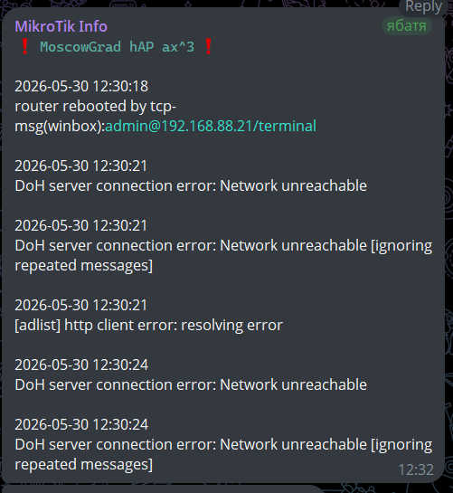

# Log events Telegram Informer   

---  

!!! attention "RoS v7 and Telegram"  
    Telegram servers are protected by Cloudflare, which enforces complex TLS 1.3/ECH handshakes. The `fetch` utility in v7 has a very short hardcoded internal timer for completing the cryptographic handshake phase. Due to DPI inspections the packets could arrive with a slight delay    
      
    Also, `fetch` in v7 tries to resolve `api.telegram.org` in all accessible addresses, including IPv6 (AAAA records). Even you have no IPv6, Cloudflare returns IPv6-addresses. `fetch` tries to start handshake over IPv6, waites for timeout, then fallbacks to IPv4 and starts new handshake. At this moment internal timer timeouts, and `fetch` drops error `handshake timed out (6)`

---  
## Specs  
- Created to post messages to dedicated topic of the specified supergroup telegram instance  
- Default filter:  
    - `logsBuffer` variable  
    - filter `topics~"(error|critical|netwatch)" || message~"([fF]ailure|router rebooted|checkRoSUpdate)"`  
- Default ignoring filter:
    - `ignoreInLog` variable   
    - ignoring messages keywords: 
        - `static dns entry changed`  
        - `changed script settings`  
        - `HTTP`  
        - `changed scheduled script setting`  
- NO time-format related troubles, mikrotik internal function `:totime` used  
- Executes every `60` seconds
- Sends messages only if `api.telegram.org` is avaiable
- Uses limit to `4096` message symbols
- Uses `HTML` syntax for messages

---  

## Logic  
```text
START
|
|─ [1] Scheduler exists? → NO: create scheduler (interval=60s)
|
|─ [2] Telegram available? (resolve api.telegram.org)
|       |─ NO → exit (silent)
|       |─ YES → continue
|
|─ [3] Get cursor (last event time) from scheduler comment
|       |─ if empty → use "1970-01-01 00:00:00"
|
|─ [4] Find logs matching: error|critical|netwatch|failure|router rebooted|checkRoSUpdate
|
|─ [5] Filter logs:
|       |─ ignore: "static dns entry changed", "changed script settings", "HTTP", "changed scheduled script setting"
|       |─ skip events older than cursor
|
|─ [6] Build message (max 4096 chars)
|       |─ header: "⚠️ <code>identity board-name</code> ⚠️"
|
|─ [7] Any new logs?
        |─ YES → POST to Telegram API (HTML parse_mode)
        |         |─ update cursor (save last event time to scheduler comment)
        |─ NO → exit (silent)

END
```

---  

## Example  
  

---  
  
## How To Use
Add as script with name `logEventTGInformer`  
- policy: read, write, test  
- do not require permission: no   
- set your correct values instead of `TOKEN`, `CHATID`, `TOPICID`  

!!! bug "known issue"  
    log text parser failes for keyword `HTTP`  
    so `HTTP` keyword added to ignore filter  

!!! warning "If telegram is blocked"  
    allow MikroTik to access `api.telegram.org` via VPN  
    (well-configured VPN required)  
### commands
```bash  
# allow MikroTik to connect api.telegram.org by itself
# example with DNS FWD and vpn_out routing table
/ip dns static
add address-list=to_VPN_FWD comment="Messengers - Telegram - used by router itself" disabled=no match-subdomain=yes name=api.telegram.org ttl=1d type=FWD

/ip firewall mangle
add action=mark-connection chain=output comment="MikroTik itself to vpn step 1" connection-mark=no-mark dst-address-list=to_VPN_FWD dst-address-type=!local \
    new-connection-mark=self_to_vpn
add action=mark-routing chain=output comment="MikroTik itself  to vpn step 2" connection-mark=self_to_vpn new-routing-mark=vpn_out passthrough=no
```

---  

## Code
```bash
# =================================== 
# logEventTGInformer v2 | by xdenb43
# 30.05.2026:
#   - Fixed, Optimized & Internet-aware
#   - switch from unstable markdown to html format
# tested on
#   - RoS 7.23
# =================================== 

# -----------------------------------
# CONFIGURATION
# -----------------------------------
:local scriptName "logEventTGInformer";

:local tgBotToken "$TOKEN";
:local tgChatId "$CHATID";
:local tgTopicId "$TOPICID";

:local tgUrl ("https://api.telegram.org/bot" . $tgBotToken . "/sendMessage");
:local mikrotId ("&#10071; <code>" . [/system identity get name] . " " . [/system resource get board-name] . "</code> &#10071;");
:local messageHeader ($mikrotId . "\n\n");

:local logsBuffer [/log find \
    topics~"(error|critical|netwatch)" || \
    message~"([fF]ailure|router rebooted|checkRoSUpdate)"];
:local ignoreInLog {
    "static dns entry changed"; 
    "changed script settings"; 
    "HTTP"; 
    "changed scheduled script setting"
    };
    
# 4KB of text (4096 latin characters).
:local symbolsLimit 4096;
:local defaultTime "1970-01-01 00:00:00";

# -----------------------------------
# SCHEDULER
# -----------------------------------
# warn if schedule does not exist and create it
:if ([:len [/system scheduler find name="$scriptName"]] = 0) do={
    /log warning "[$scriptName] Alert : Schedule does not exist. Creating schedule ....";
    :delay 1s;
    /system scheduler add name=$scriptName interval=60s start-time=startup on-event=logEventTGInformer policy=read,write,test;
    /log warning "[$scriptName] Alert : Schedule created!";
}

# -----------------------------------
# PRE-CHECK: REAL TELEGRAM AVAILABILITY (ICMP)
# -----------------------------------
:local telegramAvailable false;
:if ([/tool ping api.telegram.org count=1] > 0) do={
    :set telegramAvailable true;
} else={
    :set telegramAvailable false;
}

# -----------------------------------
# MAIN PART
# -----------------------------------
:if ($telegramAvailable) do={
    # CURSOR (time-based)
    :local lastCursor [/system scheduler get [find name="$scriptName"] comment];
    :if ([:len $lastCursor] = 0) do={
        :set lastCursor ($defaultTime);
    }

    :local messageText $messageHeader;
    :local eventCursor;
    :if ([:len $logsBuffer] > 0) do={
        :foreach line in=$logsBuffer do={
            :local eventTime [/log get $line time];
            :if ([:len $eventTime] != 0) do={
                :local message [:tostr [/log get $line message]];
                :local keepLog true;

                # ignore filter
                :foreach j in=$ignoreInLog do={
                    :if ($message ~ $j) do={
                        :set keepLog false;
                    }
                }

                :if ($keepLog && ([:totime $eventTime] > [:totime $lastCursor])) do={
                    :local tempResult ($eventTime . "\n" . $message . "\n\n");

                    # lenght limit check
                    :if (([:len $messageText] + [:len $tempResult]) < $symbolsLimit) do={
                        :set messageText ($messageText . $tempResult);
                        :set eventCursor $eventTime;
                    }
                }
            }
        }
    }

    # send to telegram
    :if ([:len $messageText] > [:len $messageHeader]) do={
        :local fetchSuccess false;

        :do {
            /tool fetch \
                url=$tgUrl \
                http-method=post \
                http-header-field="Content-Type: application/json" \
                http-data=("{\"chat_id\":\"" . $tgChatId . "\",\"message_thread_id\":\"" . $tgTopicId . "\",\"text\":\"" . $messageText . "\",\"parse_mode\":\"HTML\"}") \
                keep-result=no;
            :set fetchSuccess true;
        } on-error={
            # Telegram delivery failed (HTTP error or SSL timeout). Retrying next turn
            :set fetchSuccess false;
        }

        :if ($fetchSuccess) do={
            /system scheduler set [find name=$scriptName] comment=$eventCursor;
        }
    }
}
```  
